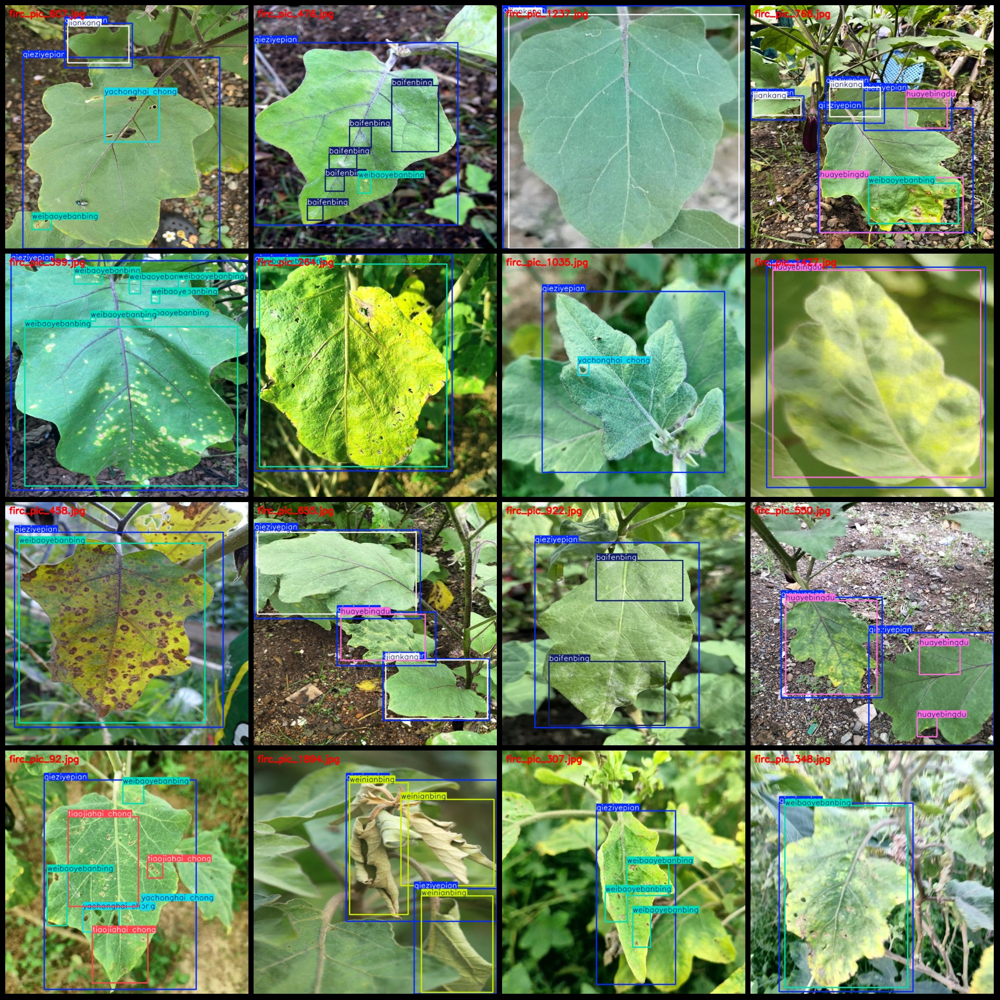
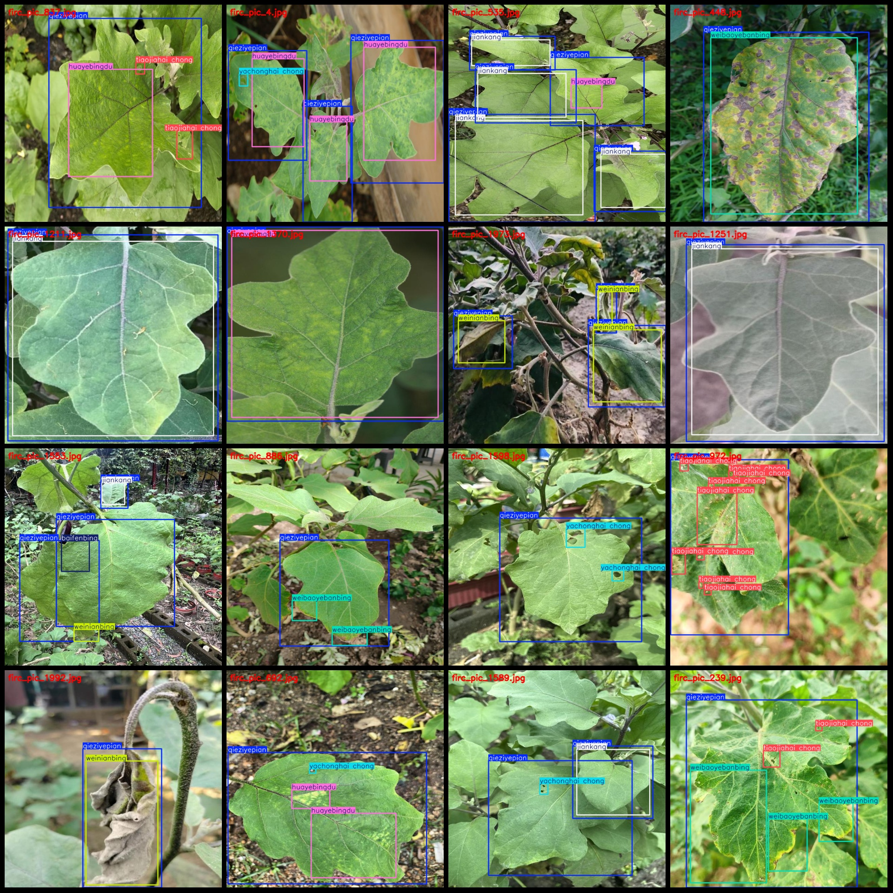

# Dataset of Detecting Pathogenic Fungi on Eggplant Leaves in VOC+YOLO format with 2087 images and 8 categories

Dataset information

- **Image Count**: 2087
- **Annotation Count**: 2087
- **Annotation Class Count**: 8
- **annotation class names**: ["baifenbing", "huayebingdu", "jiankang", "qieziyepian", "tiaojiahai chong", "weibaoyebanbing", "weinianbing", "yachonghai chong"]
- **corresponding Chinese class names**: ["White Powdery Disease", "Pink Vein Virus", "Health", "Tomato Leaves", "Adelgids", "Blight Disease", "Withering Disease", "Aphid Pest"]
- **Number of boxes per category**:
  - **baifenbing**: 1799
  - **huayebingdu**: 999
  - **jiankang**: 913
  - **qieziyepian**: 3584
  - **tiaojiahai chong**: 1502
  - **weibaoyebanbing**: 1869
  - **weinianbing**: 619
  - **yachonghai chong**: 851
- **Total Boxes**: 12136
- **Number of Images per Category**:
  - **baifenbing**: 348
  - **huayebingdu**: 494
  - **jiankang**: 556
  - **qieziyepian**: 2081
  - **tiaojiahai chong**: 447
  - **weibaoyebanbing**: 635
  - **weinianbing**: 343
  - **yachonghai chong**: 381
- **Image Resolution**: 640x640
- **Annotation Tool**: labelImg
- **Annotation Rules**: Draw rectangles around the categories.
- **Important Note**: The dataset does not have splits for training/validation/testing, so you need to manually split it.
- **Special Disclaimer**: This dataset does not guarantee any accuracy in the trained models or weight files.

### Image Preview

---

Please note that the above data is in English description, where information and examples are presented in English. If you need further help, please let me know.
## Images

Here is a pay link on Stripe ( https://buy.stripe.com/3cs8yP7sY87d0vu9AB ). Please contact me lonlonago@foxmail.com after funding $89, and I will send you a complete data files , thank you!

